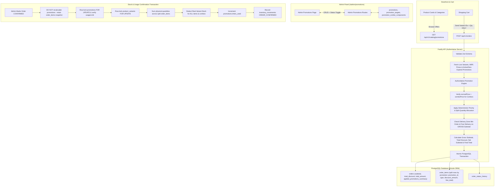

# Production-Safe Offers & Promotions System (V1) for Swami Super Market
*(Updated with All Review Feedback & Final Locked Rules: Checkout Snapshot Preservation & Mandatory Combo Savings)*

## Overview
A comprehensive, production-safe Offers & Promotions engine for Swami Super Market that supports:
1. **Simple Discounts**: Percentage (%) or Flat (₹) discounts on Products, Variants, or Categories with optional minimum quantities and minimum purchase amounts.
2. **Buy X Get Y (BOGO)**: Restricted to **Product or Variant only** (eliminates cross-product category ambiguity). Buy X get Y free, or get Y at a specified percentage discount (e.g. Buy 1 Get 1 Free, Buy 2 Get 1 Free, Buy 2 Get 1 at 50% off).
3. **Multi-Product Combos / Bundles**: Fixed package bundle pricing with physical component variant validation and zero fake inventory. **Mandatory Combo Savings Rule**: A combo only applies if `normalComponentPriceTotal > comboPrice` (i.e. `comboDiscount > 0`).
4. **Targeting & Lifecycle**:
   - Simple Discounts: Target `PRODUCT`, `VARIANT`, or `CATEGORY`.
   - BOGO: Target `PRODUCT` or `VARIANT` only.
   - Combos: Explicit `VARIANT` component requirements.
   - Statuses: `DRAFT`, `ACTIVE`, `EXPIRED`, `ARCHIVED`. Expiry is **derived dynamically from `endDate < now()`** without needing cron jobs.
5. **Deterministic Non-Stacking & Split Order-Item Rows**:
   - A single unit receives at most ONE promotion.
   - When different promotions apply to quantities of the same variant (e.g. 5 units total: 2 in a combo, 3 with a simple discount), the order records **split `order_items` rows** referencing the same `productVariantId`.
   - Inventory confirmation sums all rows for that `productVariantId` atomically.
6. **Preserved Delivery Semantics (Phase 4)**:
   - Delivery zone minimum order (`minOrderAmount`) and free delivery threshold (`freeDeliveryAboveAmount`) use the **gross subtotal before promotion discounts**.
7. **Pending Order Promotion Preservation**:
   - Once an order is created with status `PENDING_WHATSAPP`, the snapshotted promotion discounts and prices in `orders` and `order_items` are **100% frozen**. Confirmation does **not** recalculate promotions even if the promotion has since expired.
8. **Concurrency-Safe Usage Limits**:
   - `usageLimit` is checked at checkout and **atomically verified and incremented at order confirmation (`CONFIRMED`)**. If exceeded at confirmation, the transition fails safely with HTTP 409 and the order remains `PENDING_WHATSAPP`.
9. **Historical Order Snapshot Immutability**:
   - All applied promotions and discounts are preserved in `orders` and `order_items` snapshots, unaffected by future promotion edits or expirations.

---

## 1. Complete Promotion Architecture



---

## 2. Exact Database Schema

### Enums (`packages/shared/src/constants/enums.ts` & `packages/database/src/schema/promotions.ts`)
```ts
export const PROMOTION_TYPES = ["SIMPLE_DISCOUNT", "BUY_X_GET_Y", "COMBO"] as const;
export type PromotionType = (typeof PROMOTION_TYPES)[number];

export const PROMOTION_STATUSES = ["DRAFT", "ACTIVE", "EXPIRED", "ARCHIVED"] as const;
export type PromotionStatus = (typeof PROMOTION_STATUSES)[number];

export const DISCOUNT_TYPES = ["PERCENTAGE", "FIXED_AMOUNT", "FREE", "COMBO_PRICE"] as const;
export type DiscountType = (typeof DISCOUNT_TYPES)[number];

export const PROMOTION_TARGET_TYPES = ["PRODUCT", "VARIANT", "CATEGORY"] as const;
export type PromotionTargetType = (typeof PROMOTION_TARGET_TYPES)[number];
```

### 1. `promotions` Table (`packages/database/src/schema/promotions.ts`)
| Field | Type | Modifiers | Description |
|---|---|---|---|
| `id` | `serial` | Primary Key | Auto-incrementing identifier |
| `name` | `varchar(255)` | Not Null | E.g. "Tata Tea Gold 10% Off", "Buy 1 Get 1 Free Parle-G" |
| `description` | `text` | Nullable | Customer-facing offer description |
| `type` | `promotion_type` enum | Not Null | `SIMPLE_DISCOUNT`, `BUY_X_GET_Y`, `COMBO` |
| `status` | `promotion_status` enum | Not Null, Default `'DRAFT'` | `DRAFT`, `ACTIVE`, `EXPIRED`, `ARCHIVED` |
| `discountType` | `discount_type` enum | Not Null | `PERCENTAGE`, `FIXED_AMOUNT`, `FREE`, `COMBO_PRICE` |
| `discountValue` | `numeric(10, 2)` | Nullable | Percentage (e.g. 10.00) or fixed ₹ (e.g. 20.00) |
| `minOrderAmount` | `numeric(10, 2)` | Nullable | Minimum gross cart subtotal required |
| `minQuantity` | `integer` | Nullable, Default `1` | Minimum item quantity required |
| `buyQuantity` | `integer` | Nullable | For BOGO: Units customer must buy (e.g. 1, 2) |
| `getQuantity` | `integer` | Nullable | For BOGO: Units customer gets discounted (e.g. 1) |
| `getYDiscountPercent` | `numeric(5, 2)` | Nullable, Default `100.00` | Discount on Get-Y units (100.00 = Free, 50.00 = Half price) |
| `comboPrice` | `numeric(10, 2)` | Nullable | Fixed bundle price for combo (e.g. 499.00) |
| `startDate` | `timestamp with tz` | Nullable | Promotion start timestamp |
| `endDate` | `timestamp with tz` | Nullable | Promotion expiry timestamp |
| `priority` | `integer` | Not Null, Default `0` | Higher integer = higher priority |
| `usageLimit` | `integer` | Nullable | Max global usages allowed (null = unlimited) |
| `timesUsed` | `integer` | Not Null, Default `0` | Atomically incremented at order CONFIRMATION |
| `createdAt` | `timestamp with tz` | Not Null, Default `now()` | Audit timestamp |
| `updatedAt` | `timestamp with tz` | Not Null, Default `now()` | Updated on change |

**Indexes:**
- `promotions_status_idx` on `(status)`
- `promotions_type_idx` on `(type)`
- `promotions_priority_idx` on `(priority)`
- `promotions_dates_idx` on `(startDate, endDate)`

### 2. `promotion_targets` Table (`packages/database/src/schema/promotion_targets.ts`)
| Field | Type | Modifiers | Description |
|---|---|---|---|
| `id` | `serial` | Primary Key | Auto-incrementing identifier |
| `promotionId` | `integer` | Not Null, FK -> `promotions.id` (`onDelete: "cascade"`) | Owning promotion |
| `targetType` | `promotion_target_type` enum | Not Null | `PRODUCT`, `VARIANT`, `CATEGORY` |
| `targetId` | `integer` | Not Null | ID of target entity |
| `createdAt` | `timestamp with tz` | Not Null, Default `now()` | Creation timestamp |

**Indexes:**
- `promotion_targets_promo_idx` on `(promotionId)`
- `promotion_targets_lookup_idx` on `(targetType, targetId)`

### 3. `promotion_combo_components` Table (`packages/database/src/schema/promotion_combo_components.ts`)
| Field | Type | Modifiers | Description |
|---|---|---|---|
| `id` | `serial` | Primary Key | Auto-incrementing identifier |
| `promotionId` | `integer` | Not Null, FK -> `promotions.id` (`onDelete: "cascade"`) | Owning combo promotion |
| `productVariantId` | `integer` | Not Null, FK -> `product_variants.id` (`onDelete: "cascade"`) | Component variant |
| `quantity` | `integer` | Not Null, Default `1` | Required quantity per combo bundle |
| `createdAt` | `timestamp with tz` | Not Null, Default `now()` | Creation timestamp |

**Indexes:**
- `combo_components_promo_idx` on `(promotionId)`
- `combo_components_variant_idx` on `(productVariantId)`

### 4. Existing Table Snapshot Columns:
- **`orders` table** (`packages/database/src/schema/orders.ts`):
  - `subtotal`: Gross merchandise subtotal before promotion discounts (preserves delivery threshold semantics).
  - `totalDiscount`: `numeric("total_discount", { precision: 10, scale: 2 }).notNull().default("0.00")`.
  - `totalAmount`: `(subtotal - totalDiscount) + deliveryCharge`.
  - `appliedPromotionsSummary`: `jsonb("applied_promotions_summary").$type<Array<{ promotionId: number; name: string; type: string; discountAmount: string }>>().default([]).notNull()`.
- **`order_items` table** (`packages/database/src/schema/order_items.ts`):
  - `promotionId`: `integer("promotion_id").references(() => promotions.id, { onDelete: "set null" })`.
  - `promotionTypeSnapshot`: `varchar("promotion_type_snapshot", { length: 50 })` (e.g. `SIMPLE_DISCOUNT`, `BUY_X_GET_Y`, `COMBO`, or null).
  - `discountAmount`: `numeric("discount_amount", { precision: 10, scale: 2 }).notNull().default("0.00")`.
  - `lineTotal`: `(unitPriceSnapshot * quantity) - discountAmount`.

---

## 3. Final Locked Rules

| Area | Final V1 Production Rule | Rationale |
|---|---|---|
| **Simple Discount** | `PRODUCT`, `VARIANT`, or `CATEGORY` | Flexible percentage or flat ₹ discount on any item or full category. |
| **BOGO (Buy X Get Y)** | **`PRODUCT` or `VARIANT` only** | Prevents ambiguous cross-product free item issues in multi-product categories. |
| **Combos** | **Explicit `VARIANT` only** | Explicit required component variants & quantities for bundle formation. |
| **Mandatory Combo Savings** | **`normalComponentPriceTotal > comboPrice`** | **Lock Rule 2**: If `comboPrice >= normalComponentPriceTotal`, the combo produces zero discount and does NOT apply. Prevents deals from charging customers more. |
| **Stacking** | **Strictly Non-Stacking** | A single unit receives at most one promotion. |
| **Remaining Units** | **Can receive another promotion** | Remaining unconsumed units of an item are eligible for subsequent promotions. |
| **Order Items** | **Split rows by promotion allocation** | Clean, auditable rows with exact snapshot pricing per promotion. |
| **Pending Order Preservation** | **Retain snapshotted promotions on confirmation** | **Lock Rule 1**: Do NOT recalculate promotions on admin CONFIRMED. Snapshotted prices/discounts remain frozen even if the promo expired after order placement. |
| **Delivery Minimum** | **Gross subtotal before discounts** | Preserves Phase 4 checkout behavior. |
| **Free Delivery** | **Gross subtotal before discounts** | Preserves Phase 4 free delivery threshold semantics. |
| **Usage Limit** | **Check & increment atomically at CONFIRMED** | Eliminates race conditions without temporary cart reservation locks. |
| **Derived Expiry** | **`endDate < now()` derived dynamically** | Engine ignores expired promos; UI displays Expired badge; no cron needed. |
| **Client Discount** | **Never trusted** | Server recalculates 100% of discounts and totals from DB truth. |
| **Inventory** | **Real variant deduction on CONFIRMED** | Zero fake combo inventory; full physical quantity deducted for BOGO. |

---

## 4. Delivery Calculation Flow (Phase 4 Preserved)

```text
1. grossSubtotal = sum(unitPrice * quantity) for all cart items
2. Calculate promotions & discounts -> totalDiscount
3. netSubtotal = grossSubtotal - totalDiscount
4. Delivery Zone Minimum Check:
   if (grossSubtotal < zone.minOrderAmount) -> Throw OrderValidationError (minimum not met)
5. Delivery Zone Free Delivery Check:
   if (zone.freeDeliveryAboveAmount && grossSubtotal >= zone.freeDeliveryAboveAmount) -> deliveryCharge = 0.00
   else -> deliveryCharge = zone.deliveryCharge
6. finalTotal = netSubtotal + deliveryCharge
```

---

## 5. Mandatory Combo Savings Rule (Lock Rule 2)

```text
For each eligible combo formation:
normalComponentPriceTotal = sum(variant.sellingPrice * component.quantity * combosEligible)
comboPriceTotal = combo.comboPrice * combosEligible

comboDiscount = normalComponentPriceTotal - comboPriceTotal

if (comboDiscount <= 0):
    // Combo does NOT apply (prevents negative savings or charging more than regular price)
    combo is skipped
```

---

## 6. Split Order-Item Model & Confirmation Flow (Lock Rule 1)

### Checkout Insertion (`POST /api/v1/orders`):
Customer buys 5 units of Tata Tea Gold (₹100/unit).
- 2 units form part of a Combo (Combo discount = ₹30 for those 2 units).
- 3 remaining units receive a 10% Simple Discount (Discount = ₹30 for those 3 units).
- Two `order_items` rows are inserted:
  1. `qty = 2, unitPrice = 100.00, discountAmount = 30.00, lineTotal = 170.00, promotionType = 'COMBO', promotionId = 10`
  2. `qty = 3, unitPrice = 100.00, discountAmount = 30.00, lineTotal = 270.00, promotionType = 'SIMPLE_DISCOUNT', promotionId = 12`
- Initial order status is set to `PENDING_WHATSAPP`.

### Admin Confirmation (`PATCH /api/v1/admin/orders/:id/status` -> `CONFIRMED`):
1. **DO NOT recalculate promotions**. The order items and discounts snapshotted at checkout remain authoritative and unchanged.
2. **Lock & Verify Usage Limit**:
   Row-lock any applied promotions `FOR UPDATE`:
   ```ts
   const appliedPromoIds = [...new Set(items.map(i => i.promotionId).filter(Boolean))];
   for (const promoId of appliedPromoIds) {
     const [promo] = await tx.select().from(promotions).where(eq(promotions.id, promoId)).for("update");
     if (promo && promo.usageLimit !== null && promo.timesUsed >= promo.usageLimit) {
       throw new PromotionUsageExceededError(`Promotion "${promo.name}" has reached its usage limit.`);
     }
     await tx.update(promotions).set({ timesUsed: promo.timesUsed + 1 }).where(eq(promotions.id, promo.id));
   }
   ```
3. **Lock & Deduct Real Stock**:
   Group items by `productVariantId` to sum physical units:
   - For Variant 42 (Tata Tea): total required = 2 + 3 = 5 physical units.
   - Row-lock variant 42 `FOR UPDATE`, verify `currentStock >= 5`, and deduct 5 units.
   - Log `inventory_movements` with reason `ORDER_CONFIRMED`.

---

## 7. Dynamic Derived Expiration

In Fastify API and Next.js Storefront:
- A promotion is eligible for *new calculations* if and only if:
  ```ts
  promo.status === "ACTIVE" &&
  (!promo.startDate || new Date(promo.startDate) <= now) &&
  (!promo.endDate || new Date(promo.endDate) >= now) &&
  (promo.usageLimit === null || promo.timesUsed < promo.usageLimit)
  ```
- If `promo.status === "ACTIVE"` but `new Date(promo.endDate) < now`:
  - Promotion Engine automatically ignores it for new carts.
  - Existing pending orders retain their snapshot.
  - Admin UI displays an `Expired` pill based on the date comparison without needing background cron jobs.

---

## 8. API Routes & Shared Schemas

### Endpoints
- Public:
  - `GET /api/v1/catalog/promotions`: Active, unexpired promotions for banners and badges.
  - `GET /api/v1/catalog/promotions/:id`: Public promotion detail.
- Admin (protected by preHandler session check):
  - `GET /api/v1/admin/promotions`: List with filters (`status`, `type`, `search`).
  - `GET /api/v1/admin/promotions/:id`: Full promotion detail.
  - `POST /api/v1/admin/promotions`: Create promotion with targets/components.
  - `PUT /api/v1/admin/promotions/:id`: Update promotion with targets/components.
  - `PATCH /api/v1/admin/promotions/:id/status`: Update status (`DRAFT`, `ACTIVE`, `ARCHIVED`).
- Order Placement (`POST /api/v1/orders`):
  - Fastify authoritative promotion calculation.
  - Gross subtotal delivery checks.
  - Split `order_items` insertions.
  - Immutable WhatsApp payload.

### Shared Zod Schema (`packages/shared/src/schemas/promotion.ts`)
- Restricts BOGO targets to `PRODUCT` or `VARIANT` (rejects `CATEGORY`).
- Requires `comboPrice` and at least 2 components for `COMBO`.
- Validates percentage (1–100) and positive integer quantities.

---

## 9. Storefront & Admin UI Implementation

1. **Admin Layout (`apps/web/app/admin/layout.tsx`)**: Add "Promotions" tab with `Tag` icon.
2. **Admin Promotions Page (`apps/web/app/admin/promotions/page.tsx`)**:
   - Table with derived status pills (`Active`, `Expired`, `Draft`, `Archived`), target badges, and validity dates.
   - Create/Edit modal with conditional inputs (Simple: % or ₹, BOGO: Buy X Get Y, Combo: component builder).
   - Live natural language rule preview box.
3. **Storefront Home (`apps/web/app/(store)/page.tsx`)**: "Today's Special Offers" rail.
4. **Product Card (`apps/web/components/store/ProductCard.tsx`)**: Offer badges (`10% OFF`, `BUY 1 GET 1 FREE`, `COMBO DEAL`).
5. **Cart Page (`apps/web/app/(store)/cart/page.tsx`)**: Breakdown of Gross Subtotal, Special Offer Savings, and Net Total.

---

## 10. Verification & Test Plan

1. **Pending Order Promotion Preservation**:
   - Create order with active promotion -> Status `PENDING_WHATSAPP`.
   - Set promotion `endDate` to the past (or status to `EXPIRED`).
   - Admin confirms order -> Verify order preserves original snapshotted discount and does not alter prices.
2. **Combo Savings Enforcement**:
   - Test combo where bundle price (₹520) > normal sum (₹506) -> Verify combo does NOT apply.
   - Test combo where bundle price (₹499) < normal sum (₹506) -> Verify combo applies with ₹7 discount.
3. **Gross Subtotal Delivery Check**:
   - Cart subtotal = ₹250, Promotion discount = ₹70, Net merchandise total = ₹180.
   - Zone minimum = ₹200.
   - Verify order succeeds because gross subtotal (₹250) >= minOrderAmount (₹200).
4. **Split Order Items**:
   - Cart with 5 units of Tea (2 in combo, 3 in simple discount).
   - Verify two distinct `order_items` rows are inserted.
   - Verify admin confirmation row-locks and deducts 5 physical units.
5. **Usage Limit Concurrency**:
   - Promo with `usageLimit = 1`.
   - Two orders created in `PENDING_WHATSAPP`.
   - First confirmation succeeds; second confirmation rejects with 409 error.
